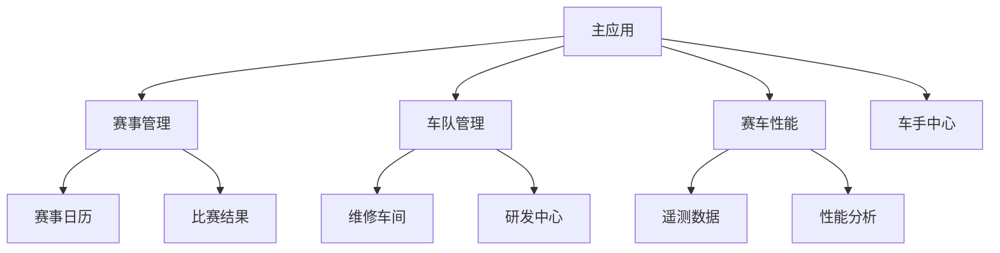

# Formula One 微前端架构设计文档

## 文档信息

| 项目名称 | Formula One 微前端架构 |
|---------|---------------------|
| 文档版本 | v1.0.0 |
| 作者 | ZeroSphere Team |
| 日期 | 2024-03-21 |
| 状态 | 已完成 |

## 目录

1. [项目概述](#1-项目概述)
2. [技术架构](#2-技术架构)
3. [系统设计](#3-系统设计)
4. [实现细节](#4-实现细节)
5. [最佳实践](#5-最佳实践)
6. [部署方案](#6-部署方案)
7. [注意事项](#7-注意事项)
8. [扩展建议](#8-扩展建议)
9. [常见问题](#9-常见问题)
10. [未来规划](#10-未来规划)
11. [测试策略](#11-测试策略)
12. [安全策略](#12-安全策略)

## 1. 项目概述

### 1.1 项目背景

Formula One 项目是一个基于微前端架构的现代化赛车管理平台，旨在提供赛事管理、车队管理、赛车性能分析等全方位服务。

微前端架构是一种将大型前端应用拆分为独立开发和部署的组件的架构方式。这种架构方式具有以下特点：

- 支持多团队并行开发
- 允许团队在确定的系统边界内进行创新
- 降低团队的认知负担
- 提高业务灵活性，支持独立更新和部署

### 1.2 项目目标

- 实现业务模块的解耦和独立部署
- 提供统一的用户体验
- 支持多团队并行开发
- 确保系统的可扩展性和可维护性
- 支持更快、更频繁地交付产品增量

### 1.3 项目范围

- 主应用框架搭建
- 微应用开发规范
- 通信机制设计
- 部署方案制定
- 跨团队协作机制

## 2. 技术架构

### 2.1 技术选型

#### 2.1.1 技术栈选择

| 类别 | 技术栈 | 说明 |
|-----|--------|------|
| 主框架 | Vue 3 + TypeScript | 提供现代化的开发体验 |
| 微前端框架 | qiankun | 基于 single-spa 的微前端解决方案 |
| 构建工具 | Vite | 快速的开发服务器和构建工具 |
| 状态管理 | Pinia | Vue 3 推荐的状态管理方案 |
| UI框架 | Element Plus | 企业级 UI 组件库 |
| 国际化 | vue-i18n | 多语言支持 |

#### 2.1.2 架构特点

微前端架构的核心特征包括：

- 由多个独立元素组成，采用类似后端微服务的模块化结构
- 每个微前端负责其有限环境中的完整实现，包括：
  - 用户界面
  - 数据管理
  - 状态/会话管理
  - 业务逻辑
  - 流程控制

### 2.2 架构图



### 2.3 部署架构

微前端支持两种主要的部署模式：

1. 仅前端模式：
   - 与共享API层集成
   - 使用集中式API Gateway
   - 适合前后端分离的项目

2. 全栈模式：
   - 每个微前端都有自己的后端实现
   - 支持后端渲染和水合（hydration）技术
   - 适合需要独立部署的全栈应用

### 2.4 技术优势

1. **开发效率**
   - 支持多团队并行开发
   - 技术栈灵活选择
   - 快速迭代和部署

2. **维护性**
   - 模块化架构
   - 清晰的边界
   - 独立的版本控制

3. **扩展性**
   - 易于添加新功能
   - 支持技术栈升级
   - 灵活的部署策略

4. **性能优化**
   - 按需加载
   - 资源隔离
   - 缓存优化


好的，这是系统设计到实现细节部分的完整内容：

## 3. 系统设计

### 3.1 项目结构

#### 3.1.1 目录结构

```
packages/
├── f1-main/          # 主应用
│   ├── src/
│   │   ├── components/    # 主应用组件
│   │   ├── layouts/       # 布局组件
│   │   ├── router/        # 路由配置
│   │   ├── stores/        # 状态管理
│   │   └── utils/         # 工具函数
│   └── package.json
├── race-micro/       # 赛事管理微应用
│   ├── src/
│   │   ├── components/    # 赛事相关组件
│   │   ├── views/         # 页面视图
│   │   ├── api/          # API接口
│   │   └── utils/        # 工具函数
│   └── package.json
├── team-micro/       # 车队管理微应用
├── car-micro/        # 赛车性能微应用
├── driver-micro/     # 车手中心微应用
└── shared/           # 共享资源
    ├── components/   # 共享组件
    ├── utils/        # 工具函数
    ├── styles/       # 共享样式
    └── types/        # 类型定义
```

#### 3.1.2 团队组织

推荐采用跨职能团队来构建微前端，每个微前端由同一个团队负责从后端到前端的完整开发。团队所有权应该覆盖从编码到生产运营的全过程。

团队职责划分：
1. 主应用团队
   - 负责整体架构设计
   - 维护共享资源
   - 协调各微应用团队
   - 确保系统整体性能

2. 微应用团队
   - 独立负责各自微应用的开发
   - 维护微应用的生命周期
   - 确保微应用性能
   - 与主应用团队协作

### 3.2 核心模块

#### 3.2.1 主应用配置

```typescript
// stores/microApp.ts
export const useMicroAppStore = defineStore('microApp', {
  state: () => ({
    loadedApps: new Map<string, MicroAppInstance>(),
    microApps: [
      {
        name: 'raceMicro',
        entry: 'http://localhost:5110',
        container: '#micro-race-container',
        prefixPath: '/race',
        props: {
          mainApp: {
            getGlobalState: () => globalState,
            setGlobalState: (state) => {
              Object.assign(globalState, state);
            }
          }
        }
      },
      {
        name: 'teamMicro',
        entry: 'http://localhost:5111',
        container: '#micro-team-container',
        prefixPath: '/team',
        props: {
          mainApp: {
            getGlobalState: () => globalState,
            setGlobalState: (state) => {
              Object.assign(globalState, state);
            }
          }
        }
      }
    ]
  }),
  actions: {
    registerMicroApp(app: MicroAppConfig) {
      // 注册微应用
    },
    unregisterMicroApp(appName: string) {
      // 注销微应用
    }
  }
})
```

#### 3.2.2 微应用生命周期

```typescript
// 微应用入口文件
import { renderWithQiankun, qiankunWindow } from 'vite-plugin-qiankun/dist/helper'

renderWithQiankun({
  bootstrap() {
    // 初始化
    console.log('微应用 bootstrap')
  },
  mount(props) {
    // 挂载
    console.log('微应用 mount', props)
    // 初始化应用
    initApp(props)
  },
  unmount(props) {
    // 卸载
    console.log('微应用 unmount', props)
    // 清理资源
    cleanup()
  },
  update(props) {
    // 更新
    console.log('微应用 update', props)
    // 更新应用状态
    updateApp(props)
  }
})

// 初始化应用
function initApp(props: any) {
  // 1. 初始化状态管理
  initStore(props)
  // 2. 初始化路由
  initRouter(props)
  // 3. 初始化UI
  initUI()
}

// 清理资源
function cleanup() {
  // 1. 清理事件监听
  // 2. 清理定时器
  // 3. 清理缓存
  // 4. 清理DOM
}
```

## 4. 实现细节

### 4.1 通信机制

#### 4.1.1 边界上下文

微前端应尽可能减少与其他微前端的业务逻辑和数据共享。必要的共享应通过明确定义的接口进行：

1. **数据共享**
   - 使用全局状态管理
   - 通过props传递数据
   - 使用localStorage/sessionStorage
   - 使用URL参数

2. **事件通信**
   - 使用自定义事件
   - 使用发布订阅模式
   - 使用消息队列

3. **共享资源**
   - 共享组件库
   - 共享工具函数
   - 共享样式
   - 共享类型定义

#### 4.1.2 事件总线

```typescript
// event-bus.ts
class EventManager {
  private static instance: EventManager;
  private eventMap: Map<string, Set<Function>> = new Map();

  private constructor() {}

  static getInstance(): EventManager {
    if (!this.instance) {
      this.instance = new EventManager();
    }
    return this.instance;
  }

  emit(eventName: string, detail: any) {
    const event = new CustomEvent(eventName, { detail });
    window.dispatchEvent(event);
  }

  on(eventName: string, callback: EventCallback) {
    if (!this.eventMap.has(eventName)) {
      this.eventMap.set(eventName, new Set());
    }
    this.eventMap.get(eventName)?.add(callback);
    window.addEventListener(eventName, callback as EventListener);
  }

  off(eventName: string, callback: EventCallback) {
    this.eventMap.get(eventName)?.delete(callback);
    window.removeEventListener(eventName, callback as EventListener);
  }

  clear() {
    this.eventMap.forEach((callbacks, eventName) => {
      callbacks.forEach(callback => {
        window.removeEventListener(eventName, callback as EventListener);
      });
    });
    this.eventMap.clear();
  }
}

export const eventBus = EventManager.getInstance();
```

#### 4.1.3 共享状态

```typescript
// shared-state.ts
interface SharedState {
  user: {
    id: string;
    name: string;
    role: string;
  };
  theme: {
    mode: 'light' | 'dark';
    primary: string;
  };
  locale: {
    language: string;
    messages: Record<string, any>;
  };
}

// 主应用共享
window.$root = {
  getCurrentLang: () => 'zh',
  registerLocale: (appName: string, lang: string, messages: any) => {
    // 注册语言包
    const currentMessages = window.$root.locale.messages || {};
    window.$root.locale.messages = {
      ...currentMessages,
      [appName]: {
        ...currentMessages[appName],
        [lang]: messages
      }
    };
  },
  setTheme: (theme: Partial<SharedState['theme']>) => {
    window.$root.theme = {
      ...window.$root.theme,
      ...theme
    };
  },
  getUser: () => window.$root.user
};
```

### 4.2 路由管理

1. **主应用路由配置**
```typescript
// router/index.ts
import { createRouter, createWebHistory } from 'vue-router'

const router = createRouter({
  history: createWebHistory(),
  routes: [
    {
      path: '/race',
      component: () => import('@/layouts/MicroAppLayout.vue'),
      children: [
        {
          path: '',
          component: () => import('@/views/RaceContainer.vue')
        }
      ]
    },
    {
      path: '/team',
      component: () => import('@/layouts/MicroAppLayout.vue'),
      children: [
        {
          path: '',
          component: () => import('@/views/TeamContainer.vue')
        }
      ]
    }
  ]
})
```

2. **微应用路由配置**
```typescript
// router/index.ts
import { createRouter, createWebHashHistory } from 'vue-router'

const router = createRouter({
  history: createWebHashHistory(),
  routes: [
    {
      path: '/',
      component: () => import('@/views/Home.vue')
    },
    {
      path: '/calendar',
      component: () => import('@/views/Calendar.vue')
    }
  ]
})
```

3. **路由前缀处理**
```typescript
// utils/route.ts
export function getPrefixPath(path: string): string {
  const prefix = window.__POWERED_BY_QIANKUN__ ? '/race' : '';
  return `${prefix}${path}`;
}
```

### 4.3 样式隔离

1. **CSS Modules 配置**
```typescript
// vite.config.ts
export default defineConfig({
  css: {
    modules: {
      localsConvention: 'camelCase',
      generateScopedName: '[name]__[local]___[hash:base64:5]'
    }
  }
})
```

2. **样式命名规范**
```scss
// 主应用样式
.main-app {
  &__header {}
  &__content {}
  &__footer {}
}

// 微应用样式
.race-app {
  &__container {}
  &__content {}
}
```

3. **全局样式隔离**
```typescript
// 主应用配置
start({
  sandbox: {
    strictStyleIsolation: true,
    experimentalStyleIsolation: true
  }
})
```

### 4.4 微应用注册与加载

#### 4.4.1 注册流程

1. **配置准备**
```typescript
// config/microApps.ts
export const microApps = [
  {
    name: 'raceMicro',
    entry: process.env.VUE_APP_RACE_ENTRY,
    container: '#micro-race-container',
    activeRule: '/race',
    props: {
      mainApp: {
        getGlobalState: () => globalState,
        setGlobalState: (state) => {
          Object.assign(globalState, state);
        }
      }
    }
  }
];
```

2. **注册步骤**
```typescript
// main.ts
import { registerMicroApps, start } from 'qiankun';

registerMicroApps(microApps, {
  beforeLoad: [
    app => console.log('before load', app.name)
  ],
  beforeMount: [
    app => console.log('before mount', app.name)
  ],
  afterMount: [
    app => console.log('after mount', app.name)
  ],
  afterUnmount: [
    app => console.log('after unmount', app.name)
  ]
});
```

3. **启动配置**
```typescript
start({
  prefetch: 'all',
  sandbox: {
    strictStyleIsolation: true,
    experimentalStyleIsolation: true
  },
  singular: true,
  excludeAssetFilter: (assetUrl) => {
    return assetUrl.includes('exclude-asset');
  }
});
```

#### 4.4.2 加载策略

1. **预加载机制**
```typescript
// preload.ts
export class PreloadManager {
  private static instance: PreloadManager;
  private preloadQueue: string[] = [];
  private isPreloading: boolean = false;

  static getInstance(): PreloadManager {
    if (!this.instance) {
      this.instance = new PreloadManager();
    }
    return this.instance;
  }

  addPreloadTask(appName: string) {
    if (!this.preloadQueue.includes(appName)) {
      this.preloadQueue.push(appName);
    }
  }

  async executePreload() {
    if (this.isPreloading) return;
    this.isPreloading = true;

    try {
      for (const appName of this.preloadQueue) {
        await this.preloadApp(appName);
      }
    } finally {
      this.isPreloading = false;
      this.preloadQueue = [];
    }
  }
}
```

2. **按需加载**
```typescript
// router/index.ts
const routes = [
  {
    path: '/race',
    component: () => import('@/views/RaceContainer.vue'),
    beforeEnter: (to, from, next) => {
      // 预加载微应用
      preloadManager.addPreloadTask('raceMicro');
      next();
    }
  }
];
```

### 4.5 错误处理机制

#### 4.5.1 错误类型

1. **加载错误**
```typescript
// error-handler.ts
export class LoadError extends Error {
  constructor(
    public appName: string,
    public error: Error,
    public type: 'entry' | 'dependency' | 'config'
  ) {
    super(`Failed to load ${appName}: ${error.message}`);
    this.name = 'LoadError';
  }
}
```

2. **运行时错误**
```typescript
// error-handler.ts
export class RuntimeError extends Error {
  constructor(
    public appName: string,
    public error: Error,
    public type: 'js' | 'state' | 'communication' | 'lifecycle'
  ) {
    super(`Runtime error in ${appName}: ${error.message}`);
    this.name = 'RuntimeError';
  }
}
```

#### 4.5.2 错误处理策略

1. **错误捕获**
```typescript
// error-handler.ts
export class ErrorHandler {
  private static instance: ErrorHandler;
  private errorMap: Map<string, Error[]> = new Map();

  static getInstance(): ErrorHandler {
    if (!this.instance) {
      this.instance = new ErrorHandler();
    }
    return this.instance;
  }

  handleError(error: Error, appName: string) {
    console.error(`[${appName}] Error:`, error);
    
    // 记录错误
    const appErrors = this.errorMap.get(appName) || [];
    appErrors.push(error);
    this.errorMap.set(appName, appErrors);

    // 错误上报
    this.reportError(error, appName);

    // 错误恢复
    this.recoveryStrategy(error, appName);
  }

  private reportError(error: Error, appName: string) {
    const errorInfo = {
      appName,
      error: error.message,
      stack: error.stack,
      timestamp: new Date().toISOString()
    };
    
    // 发送到错误监控系统
    // errorMonitor.report(errorInfo);
  }

  private recoveryStrategy(error: Error, appName: string) {
    if (error instanceof LoadError) {
      this.handleLoadError(appName);
    } else if (error instanceof RuntimeError) {
      this.handleRuntimeError(appName);
    }
  }
}
```

2. **错误恢复**
```typescript
// error-handler.ts
class ErrorHandler {
  private handleLoadError(appName: string) {
    // 1. 重试加载
    this.retryLoad(appName);
    // 2. 降级处理
    this.fallback(appName);
    // 3. 用户提示
    this.notifyUser(appName);
  }

  private handleRuntimeError(appName: string) {
    // 1. 状态恢复
    this.recoverState(appName);
    // 2. 用户提示
    this.notifyUser(appName);
    // 3. 自动重试
    this.retryOperation(appName);
  }
}
```

3. **错误上报**
```typescript
// error-monitor.ts
export class ErrorMonitor {
  private static instance: ErrorMonitor;

  static getInstance(): ErrorMonitor {
    if (!this.instance) {
      this.instance = new ErrorMonitor();
    }
    return this.instance;
  }

  report(errorInfo: ErrorInfo) {
    // 1. 收集错误信息
    const errorData = this.collectErrorData(errorInfo);
    // 2. 分类统计
    this.categorizeError(errorData);
    // 3. 追踪分析
    this.trackError(errorData);
    // 4. 评估影响
    this.assessImpact(errorData);
  }
}
```

好的，这是最佳实践到部署方案部分的完整内容：

## 5. 最佳实践

### 5.1 开发规范

#### 5.1.1 代码规范

1. **命名规范**
```typescript
// 文件命名
components/
  ├── UserProfile.vue        // 组件文件使用 PascalCase
  ├── user-profile.types.ts  // 类型文件使用 kebab-case
  └── user-profile.utils.ts  // 工具文件使用 kebab-case

// 变量命名
const userProfile = ref<UserProfile>({});  // 变量使用 camelCase
const USER_ROLES = ['admin', 'user'];      // 常量使用 UPPER_SNAKE_CASE
```

2. **目录结构规范**
```
src/
├── components/          # 组件目录
│   ├── common/         # 通用组件
│   └── business/       # 业务组件
├── views/              # 页面目录
├── stores/             # 状态管理
├── api/                # API 接口
├── utils/              # 工具函数
├── types/              # 类型定义
└── assets/             # 静态资源
```

3. **注释规范**
```typescript
/**
 * 用户信息接口
 * @interface UserInfo
 * @property {string} id - 用户ID
 * @property {string} name - 用户名称
 * @property {string} role - 用户角色
 */
interface UserInfo {
  id: string;
  name: string;
  role: string;
}

/**
 * 获取用户信息
 * @param {string} userId - 用户ID
 * @returns {Promise<UserInfo>} 用户信息
 * @throws {Error} 当用户不存在时抛出错误
 */
async function getUserInfo(userId: string): Promise<UserInfo> {
  // 实现代码
}
```

#### 5.1.2 组件开发规范

1. **组件结构**
```vue
<template>
  <div class="user-card">
    <!-- 模板内容 -->
  </div>
</template>

<script lang="ts" setup>
// 1. 导入声明
import { ref, onMounted } from 'vue'
import type { UserInfo } from '@/types'

// 2. Props 定义
const props = defineProps<{
  user: UserInfo
  showActions?: boolean
}>()

// 3. Emits 定义
const emit = defineEmits<{
  (e: 'update', value: UserInfo): void
  (e: 'delete', id: string): void
}>()

// 4. 响应式数据
const isEditing = ref(false)

// 5. 计算属性
const fullName = computed(() => `${props.user.firstName} ${props.user.lastName}`)

// 6. 方法定义
const handleEdit = () => {
  isEditing.value = true
}

// 7. 生命周期钩子
onMounted(() => {
  // 初始化逻辑
})
</script>

<style lang="scss" scoped>
.user-card {
  // 样式定义
}
</style>
```

2. **组件通信规范**
```typescript
// 1. Props 传递
interface Props {
  data: Record<string, any>;
  loading?: boolean;
  error?: Error;
}

// 2. 事件通信
const emit = defineEmits<{
  (e: 'update', value: any): void;
  (e: 'delete', id: string): void;
}>();

// 3. 依赖注入
const { theme, locale } = inject('appContext');

// 4. 状态管理
const store = useStore();
```

### 5.2 性能优化

#### 5.2.1 加载优化

1. **资源预加载**
```typescript
// preload.ts
export class ResourcePreloader {
  private static instance: ResourcePreloader;
  private preloadQueue: Set<string> = new Set();

  static getInstance(): ResourcePreloader {
    if (!this.instance) {
      this.instance = new ResourcePreloader();
    }
    return this.instance;
  }

  preloadScript(url: string) {
    const link = document.createElement('link');
    link.rel = 'preload';
    link.as = 'script';
    link.href = url;
    document.head.appendChild(link);
  }

  preloadStyle(url: string) {
    const link = document.createElement('link');
    link.rel = 'preload';
    link.as = 'style';
    link.href = url;
    document.head.appendChild(link);
  }
}
```

2. **懒加载策略**
```typescript
// lazy-load.ts
export class LazyLoader {
  private static instance: LazyLoader;
  private observer: IntersectionObserver;

  private constructor() {
    this.observer = new IntersectionObserver(
      (entries) => {
        entries.forEach(entry => {
          if (entry.isIntersecting) {
            this.loadResource(entry.target);
          }
        });
      },
      {
        rootMargin: '50px 0px',
        threshold: 0.1
      }
    );
  }

  observe(element: Element) {
    this.observer.observe(element);
  }

  private loadResource(element: Element) {
    const url = element.getAttribute('data-src');
    if (url) {
      if (element.tagName === 'IMG') {
        (element as HTMLImageElement).src = url;
      } else if (element.tagName === 'VIDEO') {
        (element as HTMLVideoElement).src = url;
      }
      this.observer.unobserve(element);
    }
  }
}
```

#### 5.2.2 运行时优化

1. **虚拟列表**
```typescript
// virtual-list.ts
export class VirtualList {
  private container: HTMLElement;
  private items: any[];
  private itemHeight: number;
  private visibleCount: number;
  private startIndex: number = 0;

  constructor(
    container: HTMLElement,
    items: any[],
    itemHeight: number,
    visibleCount: number
  ) {
    this.container = container;
    this.items = items;
    this.itemHeight = itemHeight;
    this.visibleCount = visibleCount;
    this.init();
  }

  private init() {
    this.container.style.height = `${this.items.length * this.itemHeight}px`;
    this.container.style.position = 'relative';
    this.render();
  }

  private render() {
    const start = Math.max(0, this.startIndex);
    const end = Math.min(
      this.items.length,
      this.startIndex + this.visibleCount
    );

    const fragment = document.createDocumentFragment();
    for (let i = start; i < end; i++) {
      const item = this.items[i];
      const element = this.createItemElement(item, i);
      fragment.appendChild(element);
    }

    this.container.innerHTML = '';
    this.container.appendChild(fragment);
  }

  private createItemElement(item: any, index: number): HTMLElement {
    const element = document.createElement('div');
    element.style.position = 'absolute';
    element.style.top = `${index * this.itemHeight}px`;
    element.style.height = `${this.itemHeight}px`;
    element.style.width = '100%';
    // 设置内容
    return element;
  }
}
```

2. **防抖节流**
```typescript
// debounce-throttle.ts
export function debounce<T extends (...args: any[]) => any>(
  fn: T,
  delay: number
): (...args: Parameters<T>) => void {
  let timer: NodeJS.Timeout | null = null;

  return function(this: any, ...args: Parameters<T>) {
    if (timer) clearTimeout(timer);
    timer = setTimeout(() => {
      fn.apply(this, args);
      timer = null;
    }, delay);
  };
}

export function throttle<T extends (...args: any[]) => any>(
  fn: T,
  delay: number
): (...args: Parameters<T>) => void {
  let lastTime = 0;

  return function(this: any, ...args: Parameters<T>) {
    const now = Date.now();
    if (now - lastTime >= delay) {
      fn.apply(this, args);
      lastTime = now;
    }
  };
}
```

### 5.3 测试策略

#### 5.3.1 单元测试

1. **组件测试**
```typescript
// UserCard.spec.ts
import { mount } from '@vue/test-utils';
import UserCard from './UserCard.vue';

describe('UserCard', () => {
  it('renders user information correctly', () => {
    const user = {
      id: '1',
      name: 'John Doe',
      role: 'admin'
    };

    const wrapper = mount(UserCard, {
      props: {
        user
      }
    });

    expect(wrapper.find('.user-name').text()).toBe('John Doe');
    expect(wrapper.find('.user-role').text()).toBe('admin');
  });

  it('emits update event when edit button is clicked', async () => {
    const wrapper = mount(UserCard, {
      props: {
        user: {
          id: '1',
          name: 'John Doe',
          role: 'admin'
        }
      }
    });

    await wrapper.find('.edit-button').trigger('click');
    expect(wrapper.emitted('update')).toBeTruthy();
  });
});
```

2. **工具函数测试**
```typescript
// utils.spec.ts
import { formatDate, calculateAge } from './utils';

describe('Utils', () => {
  describe('formatDate', () => {
    it('formats date correctly', () => {
      const date = new Date('2024-01-01');
      expect(formatDate(date)).toBe('2024-01-01');
    });

    it('handles invalid date', () => {
      expect(formatDate(null)).toBe('');
    });
  });

  describe('calculateAge', () => {
    it('calculates age correctly', () => {
      const birthDate = new Date('2000-01-01');
      expect(calculateAge(birthDate)).toBe(24);
    });
  });
});
```

#### 5.3.2 集成测试

1. **微应用集成测试**
```typescript
// integration.spec.ts
import { mount } from '@vue/test-utils';
import { createApp } from 'vue';
import { createRouter, createWebHistory } from 'vue-router';
import App from './App.vue';

describe('Micro App Integration', () => {
  let app: any;
  let router: any;

  beforeEach(() => {
    router = createRouter({
      history: createWebHistory(),
      routes: [
        {
          path: '/race',
          component: () => import('./views/Race.vue')
        }
      ]
    });

    app = createApp(App);
    app.use(router);
  });

  it('loads micro app correctly', async () => {
    const wrapper = mount(App);
    await router.push('/race');
    expect(wrapper.find('.race-container').exists()).toBe(true);
  });

  it('handles communication between apps', async () => {
    const wrapper = mount(App);
    await router.push('/race');
    const raceApp = wrapper.find('.race-container');
    
    // 触发事件
    await raceApp.vm.$emit('update', { id: 1, name: 'Test Race' });
    
    // 验证状态更新
    expect(wrapper.vm.$store.state.race.currentRace).toEqual({
      id: 1,
      name: 'Test Race'
    });
  });
});
```

2. **端到端测试**
```typescript
// e2e.spec.ts
import { test, expect } from '@playwright/test';

test('complete user journey', async ({ page }) => {
  // 1. 登录
  await page.goto('/login');
  await page.fill('#username', 'testuser');
  await page.fill('#password', 'password');
  await page.click('#login-button');
  await expect(page).toHaveURL('/dashboard');

  // 2. 创建赛事
  await page.click('#create-race');
  await page.fill('#race-name', 'Test Race');
  await page.fill('#race-date', '2024-12-31');
  await page.click('#save-race');
  await expect(page.locator('.success-message')).toBeVisible();

  // 3. 查看赛事列表
  await page.click('#race-list');
  await expect(page.locator('.race-item')).toContainText('Test Race');
});
```

## 6. 部署方案

### 6.1 部署架构

#### 6.1.1 前端部署

1. **静态资源部署**
```nginx
# nginx.conf
server {
    listen 80;
    server_name f1.example.com;

    # 主应用
    location / {
        root /usr/share/nginx/html/main;
        try_files $uri $uri/ /index.html;
    }

    # 赛事管理微应用
    location /race {
        alias /usr/share/nginx/html/race;
        try_files $uri $uri/ /index.html;
    }

    # 车队管理微应用
    location /team {
        alias /usr/share/nginx/html/team;
        try_files $uri $uri/ /index.html;
    }

    # 静态资源缓存
    location /assets {
        expires 1y;
        add_header Cache-Control "public, no-transform";
    }
}
```

2. **CDN 配置**
```typescript
// vite.config.ts
export default defineConfig({
  build: {
    rollupOptions: {
      output: {
        // 配置 CDN 路径
        assetFileNames: 'assets/[name].[hash][extname]',
        chunkFileNames: 'js/[name].[hash].js',
        entryFileNames: 'js/[name].[hash].js'
      }
    }
  }
});
```

#### 6.1.2 后端部署

1. **API 网关配置**
```yaml
# api-gateway.yaml
routes:
  - path: /api/race
    service: race-service
    methods:
      - GET
      - POST
      - PUT
      - DELETE
    rateLimit:
      requests: 100
      period: 1m

  - path: /api/team
    service: team-service
    methods:
      - GET
      - POST
      - PUT
      - DELETE
    rateLimit:
      requests: 100
      period: 1m
```

2. **服务发现配置**
```yaml
# service-discovery.yaml
services:
  race-service:
    host: race-service
    port: 8080
    healthCheck:
      path: /health
      interval: 30s
      timeout: 5s

  team-service:
    host: team-service
    port: 8081
    healthCheck:
      path: /health
      interval: 30s
      timeout: 5s
```

### 6.2 部署流程

#### 6.2.1 CI/CD 配置

1. **GitHub Actions 配置**
```yaml
# .github/workflows/deploy.yml
name: Deploy

on:
  push:
    branches: [ main ]

jobs:
  build-and-deploy:
    runs-on: ubuntu-latest
    steps:
      - uses: actions/checkout@v2

      - name: Setup Node.js
        uses: actions/setup-node@v2
        with:
          node-version: '16'

      - name: Install dependencies
        run: npm ci

      - name: Run tests
        run: npm test

      - name: Build
        run: npm run build

      - name: Deploy to production
        run: |
          # 部署到生产环境
          aws s3 sync dist/ s3://f1-production/
          aws cloudfront create-invalidation --distribution-id ${{ secrets.CLOUDFRONT_ID }} --paths "/*"
```

2. **Docker 配置**
```dockerfile
# Dockerfile
FROM node:16-alpine as builder

WORKDIR /app
COPY package*.json ./
RUN npm ci
COPY . .
RUN npm run build

FROM nginx:alpine
COPY --from=builder /app/dist /usr/share/nginx/html
COPY nginx.conf /etc/nginx/conf.d/default.conf
EXPOSE 80
CMD ["nginx", "-g", "daemon off;"]
```

#### 6.2.2 监控告警

1. **性能监控**
```typescript
// monitoring.ts
export class PerformanceMonitor {
  private static instance: PerformanceMonitor;

  static getInstance(): PerformanceMonitor {
    if (!this.instance) {
      this.instance = new PerformanceMonitor();
    }
    return this.instance;
  }

  measurePageLoad() {
    const timing = performance.timing;
    const loadTime = timing.loadEventEnd - timing.navigationStart;
    
    // 上报性能指标
    this.reportMetrics({
      type: 'pageLoad',
      value: loadTime,
      timestamp: new Date().toISOString()
    });
  }

  measureApiPerformance(url: string, duration: number) {
    this.reportMetrics({
      type: 'apiCall',
      url,
      duration,
      timestamp: new Date().toISOString()
    });
  }

  private reportMetrics(metrics: any) {
    // 发送到监控系统
    // monitoringSystem.report(metrics);
  }
}
```

2. **错误监控**
```typescript
// error-monitoring.ts
export class ErrorMonitor {
  private static instance: ErrorMonitor;

  static getInstance(): ErrorMonitor {
    if (!this.instance) {
      this.instance = new ErrorMonitor();
    }
    return this.instance;
  }

  captureError(error: Error, context: any) {
    const errorInfo = {
      message: error.message,
      stack: error.stack,
      context,
      timestamp: new Date().toISOString()
    };

    // 上报错误信息
    this.reportError(errorInfo);
  }

  private reportError(errorInfo: any) {
    // 发送到错误监控系统
    // errorTrackingSystem.report(errorInfo);
  }
}
```

好的，这是未来规划部分的完整内容：

## 7. 未来规划

### 7.1 技术演进

#### 7.1.1 框架升级

1. **Vue 3 特性应用**
```typescript
// 组合式 API 优化
// components/UserProfile.vue
<script setup lang="ts">
import { ref, computed, onMounted } from 'vue'
import { useUserStore } from '@/stores/user'

// 状态管理
const userStore = useUserStore()
const user = computed(() => userStore.currentUser)

// 响应式数据
const isEditing = ref(false)
const formData = ref({
  name: '',
  email: '',
  role: ''
})

// 生命周期钩子
onMounted(async () => {
  await userStore.fetchUserProfile()
})

// 方法定义
const handleSubmit = async () => {
  try {
    await userStore.updateProfile(formData.value)
    isEditing.value = false
  } catch (error) {
    console.error('更新失败:', error)
  }
}
</script>
```

2. **TypeScript 增强**
```typescript
// types/index.ts
// 类型定义增强
type MicroAppConfig = {
  name: string;
  entry: string;
  container: string;
  props?: Record<string, any>;
  activeRule: string | ((location: Location) => boolean);
}

// 泛型约束
interface ApiResponse<T> {
  code: number;
  data: T;
  message: string;
}

// 工具类型
type DeepPartial<T> = {
  [P in keyof T]?: T[P] extends object ? DeepPartial<T[P]> : T[P];
}

// 类型守卫
function isMicroAppConfig(config: any): config is MicroAppConfig {
  return (
    typeof config === 'object' &&
    typeof config.name === 'string' &&
    typeof config.entry === 'string' &&
    typeof config.container === 'string'
  )
}
```

#### 7.1.2 性能优化

1. **构建优化**
```typescript
// vite.config.ts
export default defineConfig({
  build: {
    // 代码分割
    rollupOptions: {
      output: {
        manualChunks: {
          'vendor': ['vue', 'vue-router', 'pinia'],
          'ui': ['element-plus'],
          'utils': ['lodash', 'dayjs']
        }
      }
    },
    // 压缩配置
    minify: 'terser',
    terserOptions: {
      compress: {
        drop_console: true,
        drop_debugger: true
      }
    }
  }
})
```

2. **运行时优化**
```typescript
// performance.ts
export class PerformanceOptimizer {
  private static instance: PerformanceOptimizer;

  static getInstance(): PerformanceOptimizer {
    if (!this.instance) {
      this.instance = new PerformanceOptimizer();
    }
    return this.instance;
  }

  // 图片懒加载
  setupLazyLoading() {
    const images = document.querySelectorAll('img[data-src]');
    const imageObserver = new IntersectionObserver((entries) => {
      entries.forEach(entry => {
        if (entry.isIntersecting) {
          const img = entry.target as HTMLImageElement;
          img.src = img.dataset.src!;
          imageObserver.unobserve(img);
        }
      });
    });

    images.forEach(img => imageObserver.observe(img));
  }

  // 组件预加载
  preloadComponents(components: string[]) {
    components.forEach(component => {
      const link = document.createElement('link');
      link.rel = 'modulepreload';
      link.href = `/components/${component}.js`;
      document.head.appendChild(link);
    });
  }
}
```

### 7.2 功能扩展

#### 7.2.1 新功能规划

1. **实时数据更新**
```typescript
// realtime.ts
export class RealtimeManager {
  private static instance: RealtimeManager;
  private socket: WebSocket | null = null;

  static getInstance(): RealtimeManager {
    if (!this.instance) {
      this.instance = new RealtimeManager();
    }
    return this.instance;
  }

  connect() {
    this.socket = new WebSocket('wss://api.example.com/realtime');
    
    this.socket.onmessage = (event) => {
      const data = JSON.parse(event.data);
      this.handleMessage(data);
    };

    this.socket.onclose = () => {
      setTimeout(() => this.connect(), 5000);
    };
  }

  private handleMessage(data: any) {
    switch (data.type) {
      case 'RACE_UPDATE':
        this.handleRaceUpdate(data.payload);
        break;
      case 'TEAM_UPDATE':
        this.handleTeamUpdate(data.payload);
        break;
      // 其他消息类型处理
    }
  }
}
```

2. **数据分析功能**
```typescript
// analytics.ts
export class AnalyticsManager {
  private static instance: AnalyticsManager;

  static getInstance(): AnalyticsManager {
    if (!this.instance) {
      this.instance = new AnalyticsManager();
    }
    return this.instance;
  }

  // 收集用户行为数据
  trackUserAction(action: string, data: any) {
    const event = {
      type: 'USER_ACTION',
      action,
      data,
      timestamp: new Date().toISOString()
    };
    this.sendAnalytics(event);
  }

  // 收集性能数据
  trackPerformance(metrics: any) {
    const event = {
      type: 'PERFORMANCE',
      metrics,
      timestamp: new Date().toISOString()
    };
    this.sendAnalytics(event);
  }

  private sendAnalytics(event: any) {
    // 发送到分析系统
    // analyticsSystem.send(event);
  }
}
```

#### 7.2.2 用户体验优化

1. **主题定制**
```typescript
// theme.ts
export class ThemeManager {
  private static instance: ThemeManager;
  private currentTheme: string = 'light';

  static getInstance(): ThemeManager {
    if (!this.instance) {
      this.instance = new ThemeManager();
    }
    return this.instance;
  }

  // 切换主题
  switchTheme(theme: 'light' | 'dark') {
    this.currentTheme = theme;
    document.documentElement.setAttribute('data-theme', theme);
    localStorage.setItem('theme', theme);
  }

  // 获取主题变量
  getThemeVariables() {
    return {
      primary: this.getVariable('--primary-color'),
      secondary: this.getVariable('--secondary-color'),
      background: this.getVariable('--background-color'),
      text: this.getVariable('--text-color')
    };
  }

  private getVariable(name: string): string {
    return getComputedStyle(document.documentElement)
      .getPropertyValue(name)
      .trim();
  }
}
```

2. **国际化支持**
```typescript
// i18n.ts
export class I18nManager {
  private static instance: I18nManager;
  private currentLocale: string = 'zh-CN';
  private messages: Record<string, any> = {};

  static getInstance(): I18nManager {
    if (!this.instance) {
      this.instance = new I18nManager();
    }
    return this.instance;
  }

  // 加载语言包
  async loadLocale(locale: string) {
    try {
      const messages = await import(`./locales/${locale}.ts`);
      this.messages[locale] = messages.default;
      this.currentLocale = locale;
    } catch (error) {
      console.error(`Failed to load locale: ${locale}`, error);
    }
  }

  // 翻译文本
  t(key: string, params?: Record<string, any>): string {
    const keys = key.split('.');
    let value = this.messages[this.currentLocale];
    
    for (const k of keys) {
      value = value?.[k];
    }

    if (!value) return key;

    if (params) {
      return value.replace(/\{(\w+)\}/g, (_, key) => params[key] || '');
    }

    return value;
  }
}
```

### 7.3 安全加固

#### 7.3.1 安全策略

1. **XSS 防护**
```typescript
// security.ts
export class SecurityManager {
  private static instance: SecurityManager;

  static getInstance(): SecurityManager {
    if (!this.instance) {
      this.instance = new SecurityManager();
    }
    return this.instance;
  }

  // 输入净化
  sanitizeInput(input: string): string {
    return input
      .replace(/&/g, '&amp;')
      .replace(/</g, '&lt;')
      .replace(/>/g, '&gt;')
      .replace(/"/g, '&quot;')
      .replace(/'/g, '&#x27;')
      .replace(/\//g, '&#x2F;');
  }

  // CSP 配置
  setupCSP() {
    const meta = document.createElement('meta');
    meta.httpEquiv = 'Content-Security-Policy';
    meta.content = `
      default-src 'self';
      script-src 'self' 'unsafe-inline' 'unsafe-eval';
      style-src 'self' 'unsafe-inline';
      img-src 'self' data: https:;
      connect-src 'self' https://api.example.com;
    `;
    document.head.appendChild(meta);
  }
}
```

2. **CSRF 防护**
```typescript
// csrf.ts
export class CSRFProtection {
  private static instance: CSRFProtection;

  static getInstance(): CSRFProtection {
    if (!this.instance) {
      this.instance = new CSRFProtection();
    }
    return this.instance;
  }

  // 生成 CSRF Token
  generateToken(): string {
    const token = Math.random().toString(36).substring(2);
    localStorage.setItem('csrf-token', token);
    return token;
  }

  // 验证 CSRF Token
  validateToken(token: string): boolean {
    const storedToken = localStorage.getItem('csrf-token');
    return token === storedToken;
  }

  // 添加 CSRF 头部
  addCSRFHeader(headers: Headers): Headers {
    const token = this.generateToken();
    headers.append('X-CSRF-Token', token);
    return headers;
  }
}
```

#### 7.3.2 监控告警

1. **安全监控**
```typescript
// security-monitor.ts
export class SecurityMonitor {
  private static instance: SecurityMonitor;

  static getInstance(): SecurityMonitor {
    if (!this.instance) {
      this.instance = new SecurityMonitor();
    }
    return this.instance;
  }

  // 监控异常请求
  monitorRequests() {
    const originalFetch = window.fetch;
    window.fetch = async (...args) => {
      try {
        const response = await originalFetch(...args);
        this.checkResponse(response);
        return response;
      } catch (error) {
        this.handleError(error);
        throw error;
      }
    };
  }

  // 检查响应
  private checkResponse(response: Response) {
    if (!response.ok) {
      this.reportSecurityIssue({
        type: 'HTTP_ERROR',
        status: response.status,
        url: response.url
      });
    }
  }

  // 处理错误
  private handleError(error: any) {
    this.reportSecurityIssue({
      type: 'FETCH_ERROR',
      error: error.message,
      stack: error.stack
    });
  }

  // 上报安全事件
  private reportSecurityIssue(issue: any) {
    // 发送到安全监控系统
    // securitySystem.report(issue);
  }
}
```

2. **异常检测**
```typescript
// anomaly-detection.ts
export class AnomalyDetector {
  private static instance: AnomalyDetector;
  private requestCount: number = 0;
  private lastReset: number = Date.now();

  static getInstance(): AnomalyDetector {
    if (!this.instance) {
      this.instance = new AnomalyDetector();
    }
    return this.instance;
  }

  // 检测异常请求
  detectAnomaly(request: any): boolean {
    this.requestCount++;
    
    // 重置计数器
    if (Date.now() - this.lastReset > 60000) {
      this.requestCount = 0;
      this.lastReset = Date.now();
    }

    // 检测请求频率
    if (this.requestCount > 100) {
      this.reportAnomaly({
        type: 'HIGH_FREQUENCY',
        count: this.requestCount,
        timestamp: new Date().toISOString()
      });
      return true;
    }

    return false;
  }

  // 上报异常
  private reportAnomaly(anomaly: any) {
    // 发送到异常检测系统
    // anomalySystem.report(anomaly);
  }
}
```


### 9.3 通信问题

- 确认事件名称一致
- 检查事件解绑
- 使用 TypeScript 类型

## 10. 未来规划

### 10.1 技术升级

- 升级到最新版本
- 优化构建配置
- 提升开发体验

### 10.2 功能扩展

- 添加更多微应用
- 优化通信机制
- 完善监控系统

### 10.3 性能优化

- 优化加载速度
- 减少资源占用
- 提升用户体验

## 11. 测试策略

### 11.1 单元测试

1. **测试框架选择**
   - Jest 作为主要测试框架
   - Vue Test Utils 用于组件测试
   - MSW 用于模拟 API 请求

2. **测试范围**
   - 组件单元测试
   - 工具函数测试
   - 状态管理测试

### 11.2 集成测试

1. **微应用间通信测试**
   - 事件总线测试
   - 状态共享测试
   - 路由跳转测试

2. **端到端测试**
   - Cypress 用于 E2E 测试
   - 用户流程测试
   - 性能测试

### 11.3 测试最佳实践

1. **测试覆盖率要求**
   - 单元测试覆盖率 > 80%
   - 关键业务逻辑 100% 覆盖
   - 定期进行覆盖率报告

2. **测试环境管理**
   - 独立的测试环境
   - 自动化测试流程
   - 持续集成测试

## 12. 安全策略

### 12.1 微前端安全

1. **沙箱隔离**
   - 严格样式隔离
   - JavaScript 沙箱
   - 资源加载控制

2. **通信安全**
   - 数据加密传输
   - 权限控制
   - 敏感信息保护

### 12.2 部署安全

1. **资源完整性**
   - 资源签名验证
   - 版本控制
   - 回滚机制

2. **访问控制**
   - 身份认证
   - 权限管理
   - 操作审计

## 附录

### A. 术语表

| 术语 | 说明 |
|-----|------|
| 微前端 | 一种将前端应用分解为更小、更易管理的部分的架构方法 |
| qiankun | 基于 single-spa 的微前端实现库 |
| 沙箱 | 用于隔离微应用运行环境的机制 |

### B. 参考文档

1. [qiankun 官方文档](https://qiankun.umijs.org/zh)
2. [Vue 3 文档](https://v3.vuejs.org/)
3. [Vite 文档](https://vitejs.dev/)

### C. 修订历史

| 版本 | 日期 | 修订人 | 修订内容 |
|-----|------|--------|----------|
| v1.0.0 | 2024-03-21 | ZeroSphere Team | 初始版本 |

### D. 性能指标

| 指标 | 目标值 | 说明 |
|-----|--------|------|
| 首屏加载时间 | < 2s | 主应用加载时间 |
| 微应用切换时间 | < 1s | 应用间切换耗时 |
| 内存占用 | < 100MB | 单个微应用内存占用 |

### E. 开发工具链

| 工具 | 用途 | 版本 |
|-----|------|------|
| ESLint | 代码规范检查 | 8.x |
| Prettier | 代码格式化 | 2.x |
| Husky | Git Hooks | 8.x |
| Commitlint | 提交信息规范 | 17.x |

